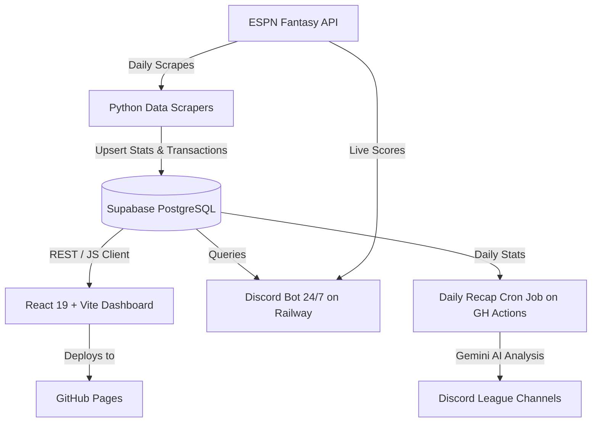

# AGENTS.md: Architecture & Developer Guidelines

This document provides system knowledge, architectural specifications, database schemas, and workflows for AI agents (including Composio and Antigravity) working on the **2026 Head to Head Heftystrong** codebase.

---

## 1. System Overview

**2026 Head to Head Heftystrong** is a full-stack fantasy baseball analytics and league management platform. It integrates real-time ESPN Fantasy data, stores structured historical and season statistics in Supabase (PostgreSQL), serves an interactive React/Vite dashboard deployed on GitHub Pages, and powers a 24/7 Discord bot with AI-driven daily recaps powered by Google Gemini.

---

## 2. League & Configuration Ground Truth

- **League ID**: `130215`
- **Season Year**: `2026`
- **Scoring Format**: Head-to-Head Each Category / Points
- **Teams & Owners**:
  - `1`: Tim
  - `2`: Adrian
  - `3`: Garrett
  - `5`: Dan (`dsellinger`)
  - `6`: Anil
  - `8`: Alex
  - `12`: Will
  - `13`: Mark
  - `14`: Preston

### ESPN Stat ID Mapping
ESPN Fantasy Baseball encodes statistics as numeric string keys:

| ID | Stat Name | Category | Description |
|:---|:---|:---|:---|
| `0` | AB | Batting | At Bats |
| `1` | H | Batting | Hits |
| `2` | AVG | Batting | Batting Average |
| `3` | 2B | Batting | Doubles |
| `4` | 3B | Batting | Triples |
| `5` | HR | Batting | Home Runs |
| `10` | BB | Batting | Walks (Batting) |
| `12` | HBP | Batting | Hit By Pitch |
| `16` | PA | Batting | Plate Appearances |
| `17` | OBP | Batting | On-Base Percentage |
| `20` | R | Batting | Runs Scored |
| `21` | RBI | Batting | Runs Batted In |
| `23` | SB | Batting | Stolen Bases |
| `34` | IP | Pitching | Innings Pitched |
| `37` | H_Allowed | Pitching | Hits Allowed |
| `39` | BB_Allowed | Pitching | Walks Allowed (Pitching) |
| `45` | ER | Pitching | Earned Runs |
| `48` | K | Pitching | Strikeouts (Pitching) |
| `57` | SV | Pitching | Saves |
| `60` | HD | Pitching | Holds |
| `63` | QS | Pitching | Quality Starts |

---

## 3. Component Breakdown

### A. Frontend Dashboard (`src/`)
- **Stack**: React 19, Vite, Tailwind CSS, Recharts, `idb-keyval` (IndexedDB caching).
- **Hosting**: GitHub Pages (`https://dsellinger-braves.github.io/2026-head-to-head`).
- **Key Files**:
  - `src/App.jsx`: Main routing, state orchestration, IndexedDB cache management, and view navigation.
  - `src/supabaseClient.js`: Supabase JS client initialized with `VITE_SUPABASE_URL` and `VITE_SUPABASE_ANON_KEY`.
  - `src/views/`:
    - `LiveScoreboardView.jsx`: Real-time matchup scores, category leads, and live rosters.
    - `HighlightsView.jsx`: Category leaders, notable daily performances.
    - `ProgressionView.jsx`: Historical standings trends and cumulative scoring over time.
    - `SummaryView.jsx`: League standings, category win/loss matrices, and team summaries.
    - `TeamsView.jsx`: Individual team roster breakdowns and stat splits.
    - `PlayersView.jsx`: Player search, ownership, and performance profiles.
    - `OwnerDisparitiesView.jsx`: Head-to-head owner records, trade analysis, and matchup histories.
    - `WeeklyView.jsx`: Week-by-week matchup box scores.
- **Build / Deploy**:
  - `npm run dev`: Local Vite development server.
  - `npm run build`: Production bundle (`dist/`).
  - `npm run deploy`: Deploy to `gh-pages` branch.

### B. Python Data Pipelines
- `active-stats-pull.py`: Scrapes active rosters and daily player statistics from ESPN API for the current season and upserts them into `player_daily_stats`.
- `transaction-scraper.py`: Extracts trades, waivers, free agent adds/drops, and updates `transactions`.
- `projections.py`: Computes rest-of-season and end-of-season projected category totals and standings.
- `historical.py`: Parses historical multi-year league archives and loads into `historical_data`.
- `migrate_historical_data.py`: Migration script for populating the active Supabase instance.

### C. Discord Bot & Daily Recap
- `discord-bot.py`:
  - 24/7 Discord bot hosted on Railway.
  - Slash commands: `/live`, `/standings`, `/roster`, `/projections`, `/transactions`, `/matchup`.
  - Uses `discord.py` and queries Supabase + ESPN APIs live.
- `discord-daily-recap.py`:
  - Runs daily via GitHub Actions scheduled workflow (`.github/workflows/discord-recap.yml`).
  - Fetches the day's box scores and top performers, uses Google Gemini (`google-genai`) to generate editorial commentary, and posts embeds to Discord.

---

## 4. Database Schema (Supabase PostgreSQL)

Active Project URL: `https://wczdkcdqgtzlsbssogoz.supabase.co`

### 1. `player_daily_stats`
Stores individual player performance per scoring period:
- `id`: UUID (PK, default `gen_random_uuid()`)
- `league_id`: BIGINT
- `team_id`: INT
- `scoring_period_id`: INT
- `player_id`: INT
- `full_name`: TEXT
- `lineup_slot_id`: INT
- `stats`: JSONB (key-value mapping of ESPN stat ID -> value)
- `updated_at`: TIMESTAMPTZ
- **Constraint**: `UNIQUE (league_id, scoring_period_id, player_id)`

### 2. `transactions`
Tracks roster moves, add/drops, and trades:
- `espn_transaction_id`: TEXT (PK)
- `league_id`: BIGINT
- `transaction_type`: TEXT
- `transaction_date`: TIMESTAMPTZ
- `scoring_period_id`: INT
- `to_team_id`: INT
- `from_team_id`: INT
- `player_id`: INT
- `player_name`: TEXT
- `raw_type`: TEXT

### 3. `historical_data`
Multi-season archival table:
- `_db_id`: UUID (PK)
- `league_id`: BIGINT
- `season_year`: INT
- `team_id`: INT
- `scoring_period_id`: INT
- `id`: INT (player_id)
- `onteamid`: INT
- `"fullName"`: TEXT
- `"lineupSlotID"`: INT
- `"0"` through `"99"`: FLOAT8 (dynamic ESPN stat columns)
- **Constraint**: `UNIQUE (league_id, season_year, scoring_period_id, team_id, id)`

---

## 5. Development & GitHub Guidelines for Agents

All AI agents (Composio, Antigravity, Claude Code) must follow these operational rules:

1. **Branch Before Modifying**:
   - Never commit experimental changes directly to `main`.
   - Create a descriptive feature branch: `git checkout -b feat/feature-name` or `fix/issue-name`.
2. **Pre-Commit Verification**:
   - For frontend changes: Always run `npm run lint` and `npm run build` before committing.
   - For database/pipeline changes: Validate queries with environment variables; do not hardcode credentials.
3. **Pull Request Automation via Composio**:
   - After pushing a branch, use Composio's GitHub tool (`GITHUB_CREATE_PULL_REQUEST`) to create a PR on `dsellinger-braves/2026-head-to-head`.
   - Provide a clear summary of changes, rationale, and verification steps in the PR description.
4. **Environment Secrets**:
   - Never log or commit raw API keys (`SUPABASE_KEY`, `DISCORD_BOT_TOKEN`, `GEMINI_API_KEY`, `ESPN_S2`, `ESPN_SWID`).
   - Read all credentials from environment variables or `.env`.
